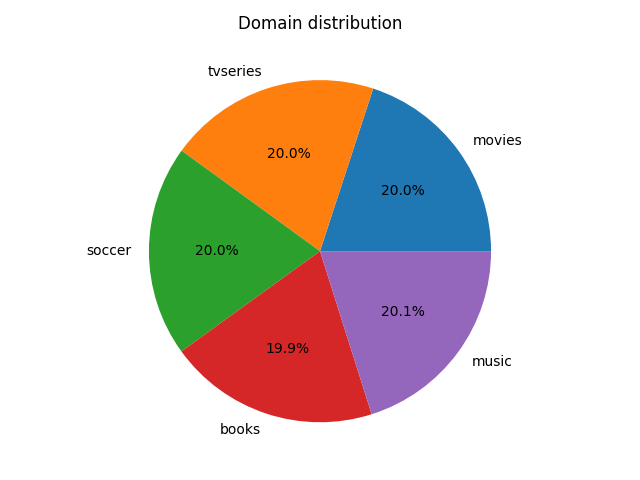
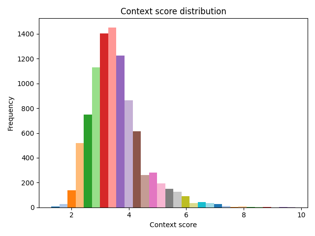

# Dataset Statistics

## Summary Comment

- Total questions: **9410**
- Average question length: **9.185 tokens**
- Average number of entities per question: **1.115**
- Average context score: **3.536**
- Domains covered: **books, movies, music, soccer, tvseries**

## Overall Statistics (All Domains)

| Metric | Avg | Median | Min | Max | Std |
| --- | --- | --- | --- | --- | --- |
| Question length (tokens) | 9.185 | 9.0 | 2 | 28 | 2.857 |
| Number of entities | 1.115 | 1.0 | 1 | 4 | 0.34 |
| Answer length (tokens) | 2.157 | 2.0 | 1 | 16 | 1.311 |
| Number of answers | 1.022 | 1.0 | 1 | 6 | 0.189 |
| Context score | 3.536 | 3.4 | 1.3 | 9.8 | 0.959 |

## Per-Domain Statistics

### Question length (tokens)

| Domain | Avg | Median | Min | Max | Std |
| --- | --- | --- | --- | --- | --- |
| books | 9.283 | 9.0 | 3 | 25 | 2.856 |
| movies | 9.145 | 9 | 2 | 28 | 3.038 |
| music | 8.871 | 9 | 3 | 24 | 2.651 |
| soccer | 9.21 | 9 | 3 | 27 | 2.832 |
| tvseries | 9.418 | 9 | 2 | 25 | 2.87 |

### Number of entities

| Domain | Avg | Median | Min | Max | Std |
| --- | --- | --- | --- | --- | --- |
| books | 1.096 | 1.0 | 1 | 4 | 0.312 |
| movies | 1.127 | 1 | 1 | 3 | 0.352 |
| music | 1.112 | 1 | 1 | 4 | 0.343 |
| soccer | 1.117 | 1 | 1 | 4 | 0.344 |
| tvseries | 1.123 | 1 | 1 | 4 | 0.35 |

### Answer length (tokens)

| Domain | Avg | Median | Min | Max | Std |
| --- | --- | --- | --- | --- | --- |
| books | 2.245 | 2.0 | 1 | 16 | 1.35 |
| movies | 2.2 | 2 | 1 | 13 | 1.087 |
| music | 2.071 | 2 | 1 | 16 | 1.414 |
| soccer | 2.157 | 2 | 1 | 13 | 1.397 |
| tvseries | 2.116 | 2 | 1 | 15 | 1.272 |

### Number of answers

| Domain | Avg | Median | Min | Max | Std |
| --- | --- | --- | --- | --- | --- |
| books | 1.014 | 1.0 | 1 | 3 | 0.13 |
| movies | 1.024 | 1 | 1 | 5 | 0.187 |
| music | 1.023 | 1 | 1 | 6 | 0.22 |
| soccer | 1.02 | 1 | 1 | 4 | 0.197 |
| tvseries | 1.03 | 1 | 1 | 4 | 0.196 |

### Context score

| Domain | Avg | Median | Min | Max | Std |
| --- | --- | --- | --- | --- | --- |
| books | 3.552 | 3.4 | 1.6 | 9.3 | 0.952 |
| movies | 3.532 | 3.4 | 1.3 | 9.8 | 1.022 |
| music | 3.44 | 3.4 | 1.6 | 8.4 | 0.881 |
| soccer | 3.545 | 3.4 | 1.6 | 9.5 | 0.966 |
| tvseries | 3.611 | 3.4 | 1.3 | 9.7 | 0.961 |

## Distributions

.png)

